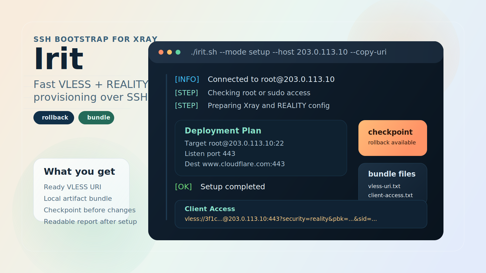
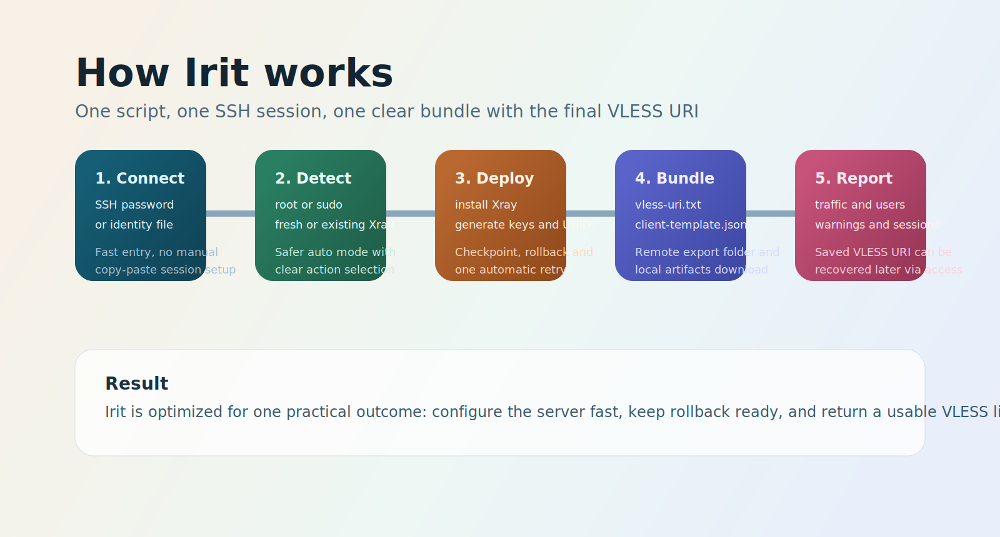

<div align="center">
  
  <h1>Irit</h1>
  <p><strong>Fast VLESS + REALITY provisioning over SSH with a ready-to-use client bundle.</strong></p>
  <p>
    <code>SSH</code>
    <code>Xray</code>
    <code>VLESS + REALITY</code>
    <code>Rollback</code>
    <code>Artifacts</code>
  </p>
</div>

> Irit is built for one practical outcome: take a clean or existing server, configure Xray fast, keep rollback ready, and return a usable VLESS link without manual parameter assembly.

<table>
  <tr>
    <td width="33%" valign="top">
      <h3>Fast setup</h3>
      Provision <code>Xray + VLESS + REALITY</code> from a single SSH session with a clean interactive flow.
    </td>
    <td width="33%" valign="top">
      <h3>Safe by default</h3>
      Create a checkpoint before changes, roll back on failure, and retry once automatically.
    </td>
    <td width="33%" valign="top">
      <h3>Useful output</h3>
      Save the final <code>VLESS</code> URI, export client files, and download a local artifact bundle.
    </td>
  </tr>
</table>

<div align="center">
  
</div>

## Why Irit

Irit is a standalone Bash tool for remote server bootstrap. It connects over SSH, detects the current Xray state, installs or rebuilds a managed configuration, and leaves you with the part that actually matters: a working VLESS link and a clean client bundle you can use right away.

## Highlights

- connect with either `--password` or `--identity-file`;
- detect whether the server is fresh or already running `Xray`;
- install Xray through the official `XTLS/Xray-install` script;
- configure `VLESS + REALITY` with `Xray API` and traffic stats enabled;
- create a checkpoint before changes;
- roll back automatically and retry once if setup fails;
- inspect a running server with a detailed `report` mode;
- recover the saved VLESS access data later via `access`;
- download the client bundle into local `artifacts/...`;
- optionally copy the final VLESS URI to the clipboard with `--copy-uri`.

## Quick Start

Recommended entrypoint:

```bash
chmod +x irit.sh fastserver.sh
./irit.sh
```

The legacy launch path still works:

```bash
bash fastserver.sh
```

Provision a new server with password authentication:

```bash
./irit.sh --mode setup --user root --host 203.0.113.10 --password 'secret' --copy-uri
```

Recover client access from an existing Irit-managed server with an SSH key:

```bash
./irit.sh --mode access --user root --host 203.0.113.10 --identity-file ~/.ssh/id_ed25519
```

## Modes

| Mode | Purpose |
| --- | --- |
| `auto` | Detect the current server state and suggest the safest next action |
| `setup` | Install or fully replace the current Xray config with an Irit-managed config |
| `reconfigure` | Rebuild the current Irit-managed configuration |
| `report` | Print a detailed diagnostic report for the server and Xray |
| `access` | Print the saved VLESS URI and refresh the exported client bundle |
| `rollback` | Restore the latest checkpoint created by Irit |

## What Irit Configures

By default, Irit builds one primary inbound with:

- protocol: `VLESS`;
- transport: `tcp`;
- security: `REALITY`;
- client port: `443`;
- local `Xray API` port: `10085`;
- REALITY destination: `www.cloudflare.com:443`;
- `serverNames`: derived from `--dest` unless explicitly overridden;
- primary client label: `client-1@irit.local`.

It also:

- enables `stats` and `api` for later traffic reporting;
- generates and stores `UUID`, `x25519` keys, and `shortId`;
- applies a `bbr` sysctl profile;
- opens the inbound port in `ufw` when `ufw` is active;
- stores managed metadata for later `access` recovery.

## What You Get After Setup

Server-side bundle location:

```text
/var/lib/fastserver-orchestrator/exports
```

Generated files:

| File | Purpose |
| --- | --- |
| `vless-uri.txt` | Final ready-to-use VLESS URI |
| `client-access.txt` | Human-readable connection summary |
| `client-template.json` | JSON outbound template for Xray-based clients |
| `connection-summary.txt` | Compact plain-text summary of the generated access data |

Local bundle location:

```text
./artifacts/<host>-<timestamp>/
```

You can change that with `--artifact-dir` or disable the local download with `--no-download`.

## Typical Workflows

### 1. Provision a new server and get the link immediately

```bash
./irit.sh --mode setup --user root --host 203.0.113.10 --password 'secret' --copy-uri
```

What happens:

- Irit connects over SSH;
- checks root or sudo access;
- creates a checkpoint;
- installs Xray if required;
- builds the `VLESS + REALITY` config;
- restarts the service;
- saves the VLESS URI;
- downloads the local client bundle.

### 2. Recover the saved VLESS URI later

```bash
./irit.sh --mode access --user root --host 203.0.113.10 --identity-file ~/.ssh/id_ed25519
```

This is useful when the server was already provisioned by Irit and you want the saved access bundle again without rebuilding the config.

### 3. Inspect the current server state

```bash
./irit.sh --mode report --user root --host 203.0.113.10 --password 'secret'
```

The report includes:

- system overview;
- Xray version and service state;
- current ports and REALITY parameters;
- configured users;
- active client connections;
- per-user traffic sampling;
- recent checkpoints;
- SSH sessions;
- recent `journalctl` warnings.

### 4. Roll back a failed setup

```bash
./irit.sh --mode rollback --user root --host 203.0.113.10 --password 'secret'
```

## CLI Options

| Option | Purpose |
| --- | --- |
| `--user USER` | SSH username |
| `--host HOST` | Server IP or hostname |
| `--password PASSWORD` | SSH password |
| `--identity-file PATH` | SSH private key instead of password |
| `--port SSH_PORT` | SSH port |
| `--listen-port PORT` | Inbound `VLESS + REALITY` port |
| `--api-port PORT` | Local `Xray API` port |
| `--dest HOST:PORT` | REALITY TLS destination |
| `--server-names CSV` | REALITY `serverNames` value |
| `--client-email EMAIL` | Primary client label |
| `--public-host HOST` | Host to embed into the client URI |
| `--sample-seconds N` | Sampling duration for report speed stats |
| `--artifact-dir DIR` | Local directory for downloaded artifacts |
| `--no-download` | Skip local bundle download |
| `--copy-uri` | Try to copy the final VLESS URI to the clipboard |
| `--force-setup` | Force reconfiguration when using `auto` |
| `--yes` | Skip confirmation prompts |
| `--no-color` | Disable colored terminal output |

## Requirements

### Local

- `bash`
- `ssh`
- `scp`
- `mktemp`
- `tar`
- `sshpass` when password authentication is used

### Remote server

- `Ubuntu` or `Debian`;
- working `root` access or `sudo`;
- internet access for the official Xray installer;
- open access to the selected client port.

## Notes

- `report` can inspect an existing Xray installation even if it was not installed by Irit;
- `access` requires a configuration that was previously created by Irit because it depends on saved metadata;
- the script manages one primary inbound and one primary client;
- `reconfigure` replaces the current Xray config with the Irit-managed variant;
- Irit avoids unrelated changes outside its own scope, but `setup` and `reconfigure` intentionally overwrite the main Xray config they manage.

## Project Layout

```text
.
├── irit.sh
├── fastserver.sh
├── assets/
│   ├── irit-terminal.svg
│   └── irit-workflow.svg
└── README.md
```

## Project Goal

Irit exists for a single focused workflow: bootstrap a server for `VLESS + REALITY`, keep rollback available, and hand back a usable access link plus client files with as little manual work as possible.
