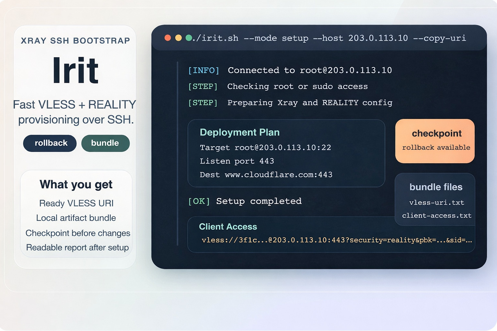
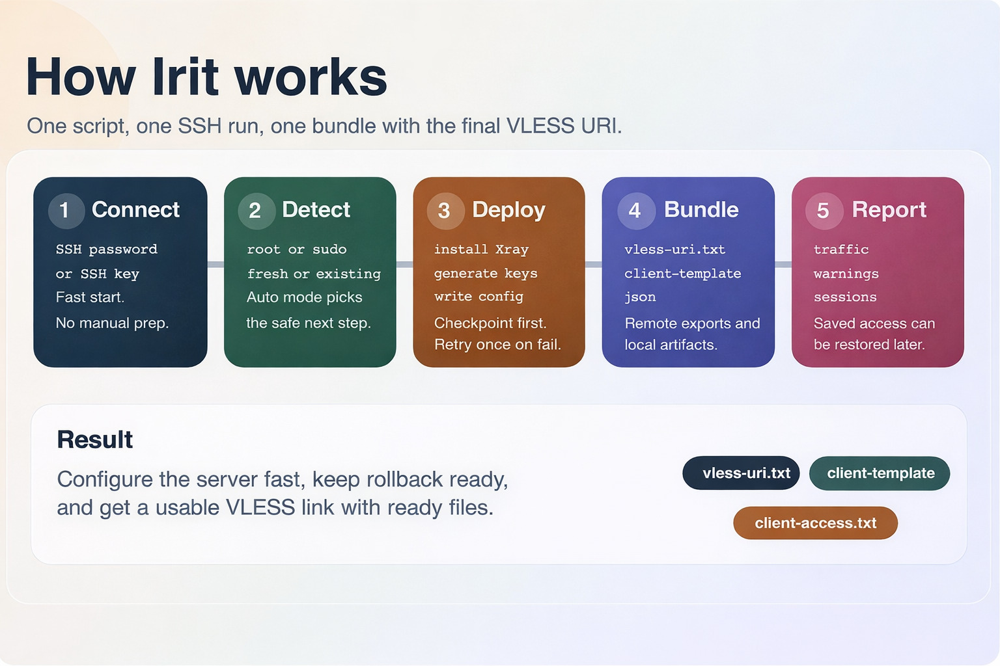

<div align="center">
  
  <h1>Irit</h1>
  <p><strong>Fast VLESS + REALITY provisioning over SSH with rollback, diagnostics, QR export, and a ready client bundle.</strong></p>
  <p>
    <a href="https://github.com/anonymmized/Irit/actions/workflows/ci.yml"></a>
    <a href="https://github.com/anonymmized/Irit/blob/main/LICENSE"></a>
    <a href="https://github.com/anonymmized/Irit/stargazers"></a>
    <a href="https://anonymmized.github.io/Irit/"></a>
  </p>
  <p>
    <code>SSH</code>
    <code>Xray</code>
    <code>VLESS + REALITY</code>
    <code>Doctor Mode</code>
    <code>Rollback</code>
    <code>Artifacts</code>
    <code>QR</code>
  </p>
</div>

> Irit is built for one practical outcome: bootstrap a server, configure Xray fast, keep rollback ready, and return a VLESS link plus client files you can use immediately.

<table>
  <tr>
    <td width="25%" valign="top">
      <h3>Fast setup</h3>
      Provision <code>Xray + VLESS + REALITY</code> from a single SSH session with a clean terminal flow.
    </td>
    <td width="25%" valign="top">
      <h3>Safe changes</h3>
      Create a checkpoint before mutation, roll back on failure, and retry once automatically.
    </td>
    <td width="25%" valign="top">
      <h3>Useful artifacts</h3>
      Export URI, Xray JSON, sing-box JSON, Mihomo YAML, manifest, hints, and QR files.
    </td>
    <td width="25%" valign="top">
      <h3>Better visibility</h3>
      Use <code>doctor</code>, <code>report</code>, and <code>access</code> to inspect, recover, and reuse the deployment later.
    </td>
  </tr>
</table>

<div align="center">
  
</div>

## Overview

Irit is a standalone Bash orchestrator for remote `Xray` servers. It connects over `SSH`, detects the current state of the machine, installs or rebuilds an Irit-managed `VLESS + REALITY` setup, and produces a clean export bundle instead of forcing you to manually collect UUIDs, public keys, short IDs, and client parameters.

## Project Links

- GitHub repository: `https://github.com/anonymmized/Irit`
- GitHub Pages landing: `https://anonymmized.github.io/Irit/`
- Launch playbook: [LAUNCH_KIT.md](LAUNCH_KIT.md)
- Contributor guide: [CONTRIBUTING.md](CONTRIBUTING.md)
- Security policy: [SECURITY.md](SECURITY.md)
- Roadmap: [ROADMAP.md](ROADMAP.md)
- Changelog: [CHANGELOG.md](CHANGELOG.md)

## What Makes It Better

- password-based SSH and `--identity-file` support;
- separate `--sudo-password` for non-root users that authenticate with SSH keys;
- `doctor` mode for non-destructive diagnostics;
- `setup`, `reconfigure`, `report`, `access`, and `rollback` modes;
- automatic checkpoint creation before changes;
- automatic rollback and one retry on failure;
- local artifact download after setup or access recovery;
- QR export for the VLESS URI;
- colored terminal summaries and cleaner deployment output;
- richer client bundle with multiple profile formats.

## Quick Start

Recommended entrypoint:

```bash
chmod +x irit.sh fastserver.sh
./irit.sh
```

Legacy direct invocation still works:

```bash
bash fastserver.sh
```

Provision a new server with password authentication:

```bash
./irit.sh --mode setup --user root --host 203.0.113.10 --password 'secret' --copy-uri
```

Inspect a server before changing anything:

```bash
./irit.sh --mode doctor --user root --host 203.0.113.10 --identity-file ~/.ssh/id_ed25519
```

Recover saved client access from an existing Irit-managed server:

```bash
./irit.sh --mode access --user root --host 203.0.113.10 --identity-file ~/.ssh/id_ed25519
```

## Modes

| Mode | Purpose |
| --- | --- |
| `auto` | Detect the current server state and suggest the safest next action |
| `doctor` | Run non-destructive diagnostics for tools, ports, exports, and Xray health |
| `setup` | Install or fully replace the current Xray config with an Irit-managed config |
| `reconfigure` | Rebuild the current Irit-managed configuration |
| `report` | Print a detailed diagnostic report for the server and Xray |
| `access` | Rebuild and print the saved VLESS access bundle |
| `rollback` | Restore the latest checkpoint created by Irit |

## What Irit Configures

By default, Irit builds one primary inbound with:

- protocol: `VLESS`;
- transport: `tcp`;
- security: `REALITY`;
- client port: `443`;
- local `Xray API` port: `10085`;
- REALITY destination: `www.cloudflare.com:443`;
- `serverNames`: derived from `--dest` unless explicitly overridden;
- primary client label: `client-1@irit.local`.

It also:

- enables `stats` and `api` for reporting and traffic sampling;
- generates and stores `UUID`, `x25519` keys, and `shortId`;
- applies a `bbr` sysctl profile;
- opens the inbound port in `ufw` when `ufw` is active;
- stores metadata for later `access` recovery;
- exports QR assets for the generated VLESS URI when `qrencode` is available.

## Deployment Flow

1. Connect over `SSH`.
2. Detect whether the server is fresh, managed, or already running Xray.
3. Create a checkpoint before mutation.
4. Install or reconfigure `Xray + VLESS + REALITY`.
5. Generate and download the client bundle.
6. Reuse `report`, `doctor`, `access`, or `rollback` later when needed.

## Client Bundle

Server-side bundle location:

```text
/var/lib/irit-orchestrator/exports
```

Local bundle location:

```text
./artifacts/<host>-<timestamp>/
```

You can change the local destination with `--artifact-dir` or disable the local download with `--no-download`.

### Bundle files

| File | Purpose |
| --- | --- |
| `vless-uri.txt` | Final ready-to-use VLESS URI |
| `client-access.txt` | Human-readable access summary |
| `connection-summary.txt` | Compact plain-text summary of the deployment |
| `client-template.json` | Xray outbound template |
| `sing-box-client.json` | sing-box client profile |
| `mihomo-profile.yaml` | Mihomo / Clash Meta style profile |
| `manifest.json` | Structured machine-readable export metadata |
| `import-hints.txt` | Quick import instructions |
| `vless-uri-qr.txt` | Terminal-friendly QR text |
| `vless-uri-qr.svg` | SVG QR code |
| `vless-uri-qr.png` | PNG QR code |

## Typical Workflows

### 1. Provision a new server and copy the URI immediately

```bash
./irit.sh --mode setup --user root --host 203.0.113.10 --password 'secret' --copy-uri
```

What happens:

- Irit connects over SSH;
- checks root or sudo access;
- creates a checkpoint;
- installs Xray if required;
- builds the `VLESS + REALITY` config;
- verifies the listener;
- saves the export bundle;
- downloads the local artifacts.

### 2. Run diagnostics before touching the machine

```bash
./irit.sh --mode doctor --user root --host 203.0.113.10 --identity-file ~/.ssh/id_ed25519
```

This mode checks:

- installed tools;
- Xray presence and systemd state;
- desired listen/API port usage;
- DNS resolution for the configured destination;
- checkpoint and export status.

### 3. Recover access from a server that was already deployed by Irit

```bash
./irit.sh --mode access --user root --host 203.0.113.10 --identity-file ~/.ssh/id_ed25519
```

This rebuilds the managed bundle, prints the saved VLESS URI again, and restores the local artifacts if downloads are enabled.

### 4. Inspect a running server in detail

```bash
./irit.sh --mode report --user root --host 203.0.113.10 --password 'secret'
```

The report includes:

- host and system overview;
- Xray version and service state;
- config-derived listen/API/REALITY data;
- active client connections;
- configured users;
- per-user traffic sampling;
- checkpoints and export state;
- SSH sessions;
- recent `journalctl` warnings.

### 5. Roll back a failed or unwanted change

```bash
./irit.sh --mode rollback --user root --host 203.0.113.10 --password 'secret'
```

## CLI Options

| Option | Purpose |
| --- | --- |
| `--user USER` | SSH username |
| `--host HOST` | Server IP or hostname |
| `--password PASSWORD` | SSH password |
| `--sudo-password PASSWORD` | Sudo password when SSH auth uses a key or differs from the SSH password |
| `--identity-file PATH` | SSH private key instead of password |
| `--port SSH_PORT` | SSH port |
| `--listen-port PORT` | Inbound `VLESS + REALITY` port |
| `--api-port PORT` | Local `Xray API` port |
| `--dest HOST:PORT` | REALITY TLS destination |
| `--server-names CSV` | REALITY `serverNames` value |
| `--client-email EMAIL` | Primary client label |
| `--public-host HOST` | Host to embed into the client URI |
| `--sample-seconds N` | Sampling duration for report speed stats |
| `--artifact-dir DIR` | Local directory for downloaded artifacts |
| `--state-root DIR` | Custom remote root for checkpoints and exports |
| `--no-download` | Skip local bundle download |
| `--copy-uri` | Try to copy the final VLESS URI to the clipboard |
| `--no-qr` | Disable QR asset generation and terminal QR output |
| `--force-setup` | Force reconfiguration when using `auto` |
| `--yes` | Skip confirmation prompts |
| `--no-color` | Disable colored terminal output |

## Requirements

### Local

- `bash`
- `ssh`
- `scp`
- `tar`
- `mktemp`
- `sshpass` when password-based SSH authentication is used

### Remote server

- `Ubuntu` or `Debian`;
- working `root` access or `sudo`;
- internet access for the official Xray installer;
- open access to the selected client port.

## Notes

- `report` can inspect an existing Xray installation even if it was not installed by Irit;
- `access` requires a configuration that was previously created by Irit because it depends on saved metadata;
- the script manages one primary inbound and one primary client;
- `reconfigure` replaces the current Xray config with the Irit-managed variant;
- Irit avoids unrelated changes outside its own scope, but `setup` and `reconfigure` intentionally overwrite the main Xray config they manage.

## Project Layout

```text
.
├── irit.sh
├── fastserver.sh
├── assets/
│   ├── irit-terminal.jpeg
│   └── irit-workflow.jpeg
└── README.md
```

## Project Goal

Irit exists for one focused workflow: bootstrap a server for `VLESS + REALITY`, preserve rollback, and hand back a usable access link plus clean client files with as little manual work as possible.
